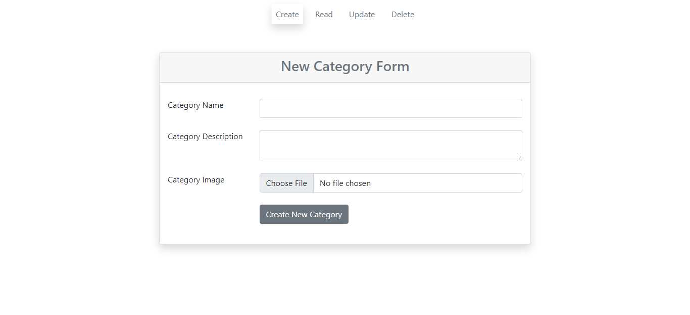
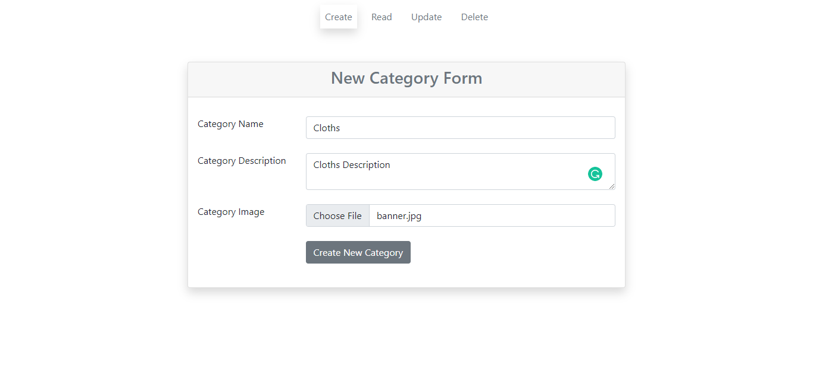
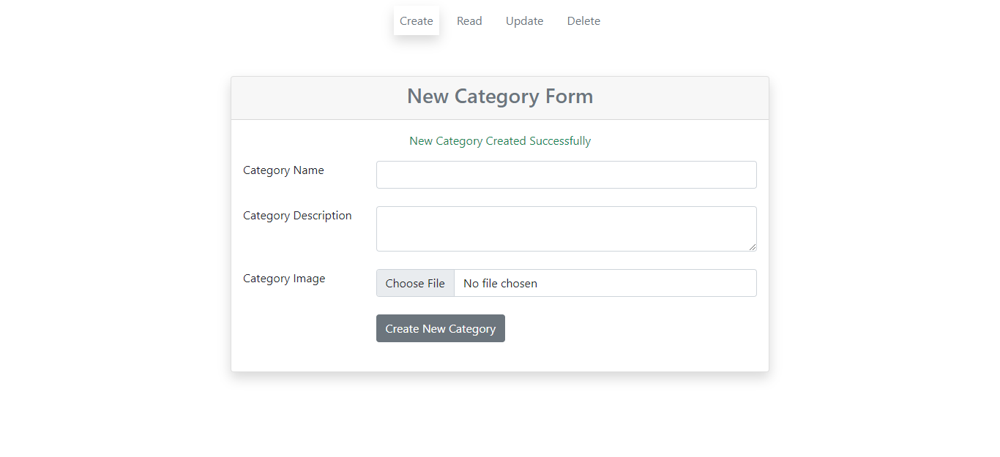
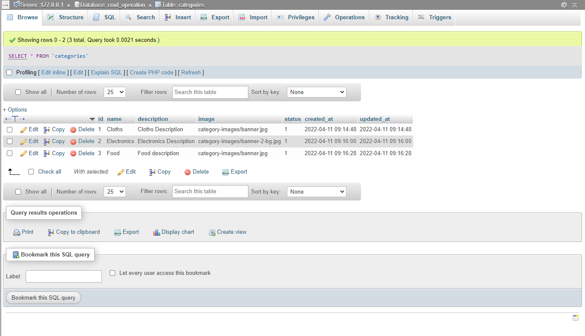
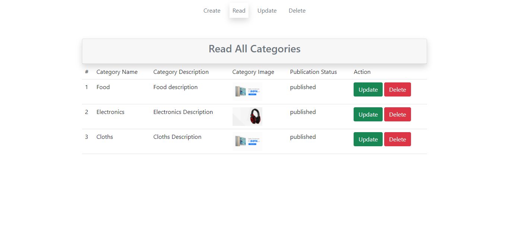
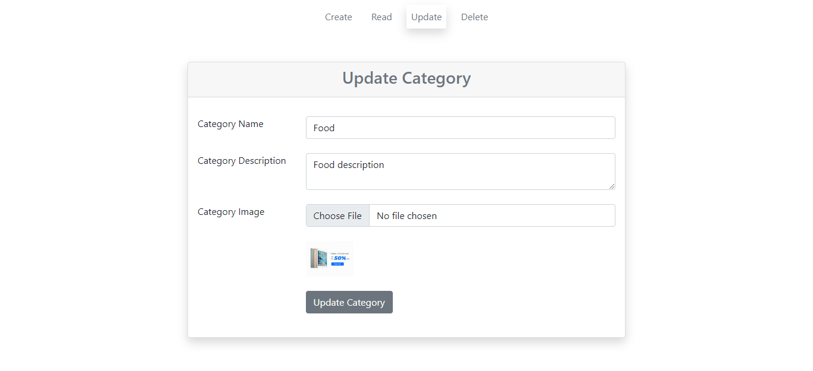
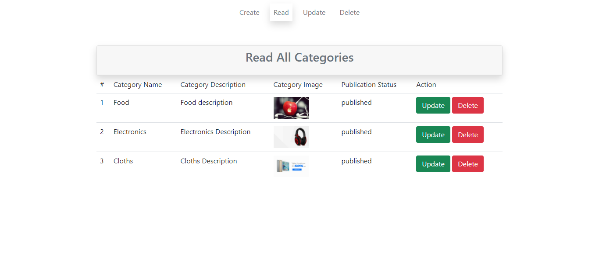
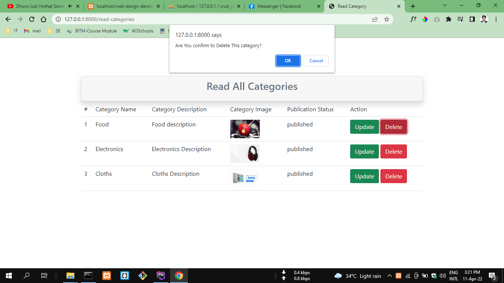
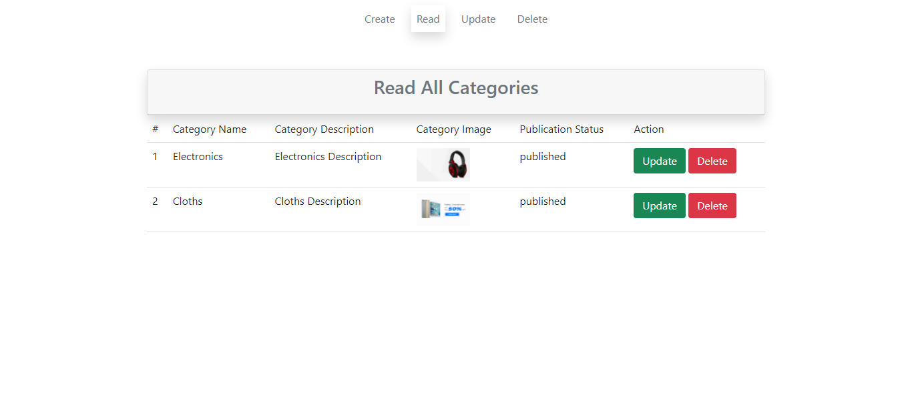

## CRUD Operations in Laravel - 9
<b>Project Description</b>  
Here I created a Category based CRUD operation. User will able to 
create, read, update & delete data from database.

#### Project Freatures
 1. Create Category
 2. Read Category
 3. Update Category
 4. Delte Category
 
 #### Project Demo
 
 
 
 
 
 
 
 
 
 
 
 #### Technologies use
  1. Laravel - 9
  2. MYSQL
  
  ##### Project Developer
  Name: <b>Mazharul Islam</b>  
  Professional Full Stack Web Developer  
  Email: <i>mazharulislam1998r@gmail.com</i>  
  Cell: <i>+880 1638574281</i>
  
  ##### Thanks 
